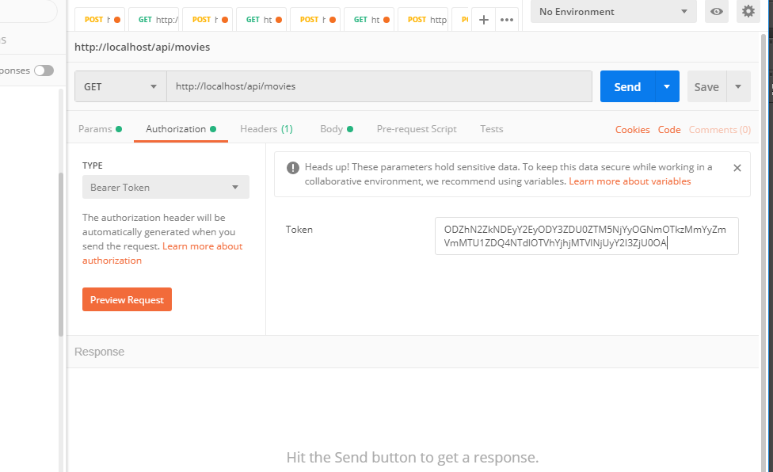

# OAuth2 authorization

## 1. Create Client

### [POST] http://localhost/createClient
### Headers:
`Content-Type: application/json`

### Body:
`
{
    "redirect-uri": "localhost",
    "grant-type": "password"
}
`

### Sample API response:
`
{
    "client_id": "4_2phncii9tiyow8cgkog484cksco8okkkc48wos8kwss4k4k0cw",
    "client_secret": "4j29nmvdwio08og4wc4kcc8wwkc0c8cwogckkcg00w0gswgw8o"
}
`

## 2. Create User
```bash
docker-compose run composer php bin/console fos:user:create test_user
```

## 3. Get token

### [POST] http://localhost/oauth/v2/token
### Headers:
`Content-Type: application/json`

### Body:
`
{
    "client_id": "4_2phncii9tiyow8cgkog484cksco8okkkc48wos8kwss4k4k0cw",
    "client_secret": "4j29nmvdwio08og4wc4kcc8wwkc0c8cwogckkcg00w0gswgw8o",
    "grant_type" : "password",
    "username" : "test_user",
    "password" : "test"
}
`

### Sample API response:
`
{
    "access_token": "ODZhN2ZkNDEyY2EyODY3ZDU0ZTM5NjYyOGNmOTkzMmYyZmVmMTU1ZDQ4NTdlOTVhYjhjMTVlNjUyY2I3ZjU0OA",
    "expires_in": 86400,
    "token_type": "bearer",
    "scope": null,
    "refresh_token": "MDc5ZjA0MjY0Y2ZjNjRkNDBhZDY4YTFjOWNhZjU2NDUwOTQ3NmY4ZTJhNmU5OTcyZTk0ODBjNWJkYzU1NGQ3OQ"
}
`

## 3. Use token

### [POST] http://localhost/api/movies


